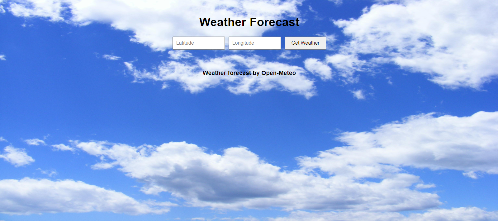
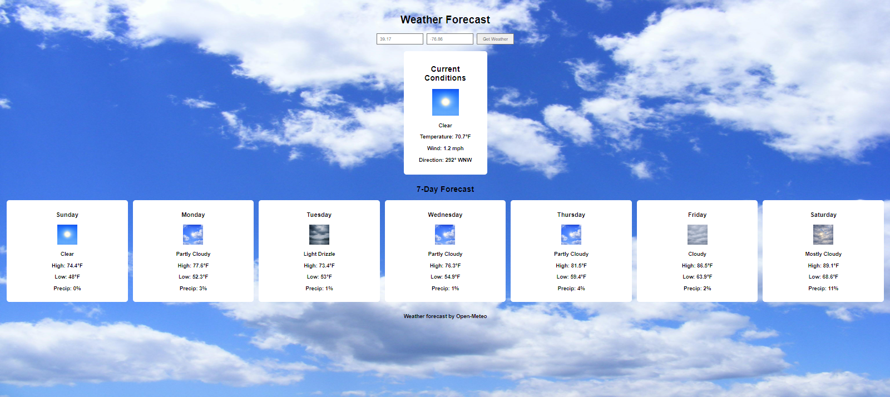

## 🌦️ Weather Forecast Dashboard
A modern, full-stack weather application built with a C#.NET Web API backend and a React frontend. The app fetches high-accuracy weather information dynamically from the Open-Meteo API based on user-provided coordinates (latitude/longitude). The backend intelligently parses WMO weather codes and serves them to a responsive React frontend dashboard showcasing real-time conditions and a 7-day forecast outlook.

------------------------------
## 📸 User Interface Preview

## 1. Initial Coordinates Entry Form

## 2. Live Weather Conditions & 7-Day Forecast Dashboard

------------------------------
## 🚀 Features

* Coordinate-Based Lookup: Enter precise latitude and longitude values via a responsive form.
* Real-time Current Conditions: Visualizes current temperature (°F), wind speeds (mph), wind direction (degrees/cardinal), and weather condition imagery.
* 7-Day Extended Forecast: Renders high/low temperatures, precipitation likelihood, and corresponding visual states via an auto-fitting grid dashboard.
* Dynamic WMO Condition Parsing: Translates complex Open-Meteo WMO weather codes dynamically into explicit human-readable weather conditions.
* Secure Base64 Asset Pipeline: Weather condition images are securely embedded as automated Base64 data strings directly from the backend pipeline.

------------------------------
## 🛠️ Tech Stack

## Frontend

* React (Hooks state architecture)
* CSS3 (Flexbox, CSS Grid layouts, :is() functional selectors)

## Backend

* .NET Core Web API (C#)
* HttpClient Factory Integration
* Newtonsoft.Json serialization architecture
* Built-in Cross-Origin Resource Sharing (CORS) policy

------------------------------
## ⚙️ Local Development Setup

## Prerequisites

* .NET 8.0 SDK or higher
* Node.js (v18+ recommended)

## 1. Backend Setup (.NET API)

   1. Navigate to the backend directory:
   
   cd WeatherAppBackend
   
   2. Restore project dependencies:
   
   dotnet restore
   
   3. Run the development server:
   
   dotnet run --profile https
   
   The API will spin up and listen on:
   * Secure URL: https://localhost:7087
   * Insecure URL: http://localhost:5034
   
## 2. Frontend Setup (React)

   1. Navigate to the frontend directory:
   
   cd weather-frontend
   
   2. Install npm packages:
   
   npm install
   
   3. Boot up the local development environment:
   
   npm start
   
   The React development server launches on http://localhost:3000. Ensure the application remains on port 3000, as the backend CORS policy strictly permits requests originating from this host address and port number.

------------------------------
## 📂 Project Architecture Overview

├── WeatherAppBackend/                  # C# ASP.NET Core Web API Project 
│   ├── Controllers/ 
│   │   └── WeatherController.cs        # Maps coordinate queries to API routes 
│   ├── Services/ 
│   │   └── WeatherService.cs           # Handles business logic, WMO lookups, & JSON parsing 
│   ├── WeatherHttpClient.cs            # Wraps third-party external requests 
│   ├── Program.cs                      # Dependency injection, CORS rules, & middleware 
│   └── Images/                         # Asset root for weather images mapped by the service 
│ 
└── weather-frontend/                   # React Single Page Application 
    &nbsp;&nbsp;&nbsp;└── src/ 
     &nbsp;&nbsp;&nbsp;&nbsp;&nbsp;&nbsp;├── App.js                      # Central container, state management, & API fetch logic 
     &nbsp;&nbsp;&nbsp;&nbsp;&nbsp;&nbsp;└── App.css                     # App grid systems, forms, & responsive layouts 

------------------------------
